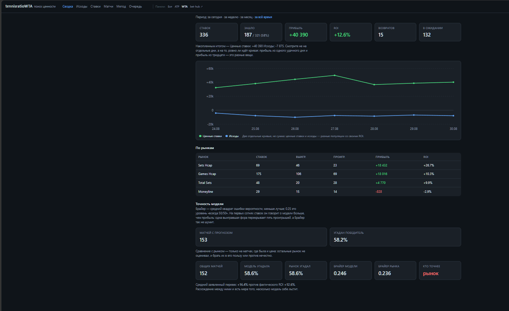

# Теннис: сбор данных, модель матча и сверка с линией

Система собирает статистику по теннисным матчам с двух сайтов, считает
вероятность исхода (Elo + Монте-Карло), сравнивает её с линией Pinnacle и
отправляет находки в Telegram. Дальше сама следит за результатами, ведёт
учёт ставок и показывает статистику на веб-панелях.

Работает на собственном сервере Ubuntu (1 ядро, 2 ГБ) — **шесть служб под
systemd** из одной копии кода.

## Что внутри

| Служба | Что делает |
|---|---|
| `tennis-bot` | основной бот: следит за афишей, ищет котировки, ведёт учёт ставок |
| `tennisratioall` | обходчик афиши ATP: разбирает **все** матчи дня, ищет расхождения с линией |
| `tennisratioall-wta` | то же для WTA — свой бот, свои журналы, свои коэффициенты |
| `bot-dashboard` | веб-панель учёта ставок (порт 8801) |
| `tra-dashboard` | панель обходчика ATP (8800) |
| `tra-dashboard-wta` | панель обходчика WTA (8802) |

Плюс таймеры: публикация прогнозов на биржу и сбор закрывающих котировок.

```
tennis_parser/      библиотека сбора: скрейперы, склейка имён, усталость,
                    симуляция, кэширующий HTTP-слой
tennisratioall/     обходчик афиши: очередь, журналы, поиск ценности, отчёты
bot_merged.py       основной телеграм-бот
dashboard*.py       веб-панели, вёрстка общая в webui.py
collect_clv.py      сбор закрывающей линии по таймеру
check_*.py          диагностика: окружение, ключи, перевес, панели
fix_*.py            починка журналов, каждый под свой класс поломки
test_*.py           юнит-тесты, каждый на конкретный разобранный баг
```

## Стек

Python 3, BeautifulSoup, Playwright (для JS-рендера), requests, systemd,
Telegram Bot API, Pinnacle API. Хранение — JSON и CSV.

Зависимостей намеренно мало. Сервер — одно ядро и два гигабайта, поэтому:
статистика (логистическая перекалибровка методом Ньютона, бутстрап-интервалы)
написана на чистом Python без numpy и scipy, а графики на панелях рисуются
инлайновым SVG прямо в разметке — без JS-библиотек и обращений к CDN.

## Панель



Панели отдаются простым `BaseHTTPRequestHandler`, графики — инлайновый SVG
без JS-библиотек и обращений к CDN.

Числа на снимке — рабочий срез, а не заявка на доходность. Обратите внимание
на нижний блок: панель сама показывает, что ошибка Брайера у линии
букмекера (0.236) меньше, чем у модели (0.246), и подписывает «кто точнее —
рынок». Показывать это на своей же панели важнее, чем красивую кривую сверху:
про то, почему +12.6% на такой выборке ничего не доказывают, — в разделе
«Что было интересного».

## Как считается прогноз

1. По паре игроков собирается статистика из двух источников: H2H, подача и
   приём, история матчей, рейтинги Elo (общий и по покрытию).
2. Из истории считается усталость и форма: минуты на корте с экспоненциальным
   затуханием, штрафы за матчи подряд, трёхсетовики и смену покрытия.
3. Монте-Карло разыгрывает матч по сетам и геймам: 5000 прогонов в
   обходчике, 10000 в боте. Формат матча определяется по турниру — на
   мужском «Шлеме» до трёх побед, везде остальное до двух.
4. Результат сравнивается с линией Pinnacle: маржа снимается нормировкой,
   и если наша вероятность даёт положительное матожидание — это кандидат.
5. Найденное уходит в Telegram и в журнал; после матча ставка закрывается
   по результату с TennisExplorer.

## Запуск

```bash
git clone https://github.com/antonantonovhh/tennis-data-public.git
cd tennis-data-public
python3 -m venv venv && ./venv/bin/pip install -r requirements.txt
./venv/bin/playwright install chromium
cp .env.example .env      # заполнить токены и ключи
```

Что означает каждая переменная и что ломается без неё — в комментариях
`.env.example`. Разбор матча из командной строки, без Telegram и служб:

```bash
./venv/bin/python3 -m tennis_parser.cli h2h "Игрок 1" "Игрок 2" --surface hard
```

Подробности по библиотеке — [docs/tennis_parser.md](docs/tennis_parser.md),
по обходчику афиши — [TENNISRATIOALL.md](TENNISRATIOALL.md).

## Что было интересного

Четыре истории, каждая стоила отдельного расследования. Все они закрыты
тестами или проверками в коде.

**Тайбрейк, который выбрасывал матч из расчёта.** Ставка неделю висела «в
игре», хотя матч давно сыгран и на сайте находился. Причина оказалась в
одном символе разметки: сет с тайбрейком записан как
`<td class="score">6<sup>10</sup></td>`, то есть текстом это `610`. Фильтр
принимал только одну-две цифры, ячейку выбрасывал, и списки геймов по двум
строкам матча получались разной длины — 4 против 3. Проверка на равенство не
проходила, и матч не попадал в результаты **вообще**. Снаружи это выглядело
как «бот не видит результат», хотя он его видел и молча отбрасывал.

**Формат матча, о котором никто не спросил.** Симуляция всегда считала матч
до двух побед. На мужском «Большом шлеме» играют до трёх, и линия у
букмекера пятисетовая — тотал 3.5 и 4.5, форы по сетам до ±2.5. Вероятности
к таким рынкам из трёхсетовой модели получаются не приближённые, а
бессмысленные: «меньше 3.5 сетов» в ней выпадает всегда. Перекос при этом
односторонний — трёхсетовая модель недооценивает фаворита, поэтому
«ценность» вылезала на андердоге: 53 ставки из 76. Формат теперь
определяется по названию турнира, с отдельным случаем для квалификации
«Шлема» — там снова до двух побед.

**Лимит биржи, вставший колом на сутки.** Рассылка держит не больше 99
активных прогнозов. При переполнении API отвечает
`publication_rejected: The pickslip could not be published` — без деталей и
совсем не похоже на лимит. Публикатор берёт один прогноз за запуск, получал
отказ, падал, и таймер через 70 секунд повторял **тот же самый**. Один
прогноз получил 481 отказ подряд за девять часов; публикации упали с 91 в
день до одной, а 33 живых прогноза протухли в очереди, не выйдя вовсе.
Лечится проверкой занятых слотов **у себя, до обращения к API**.

**Проверка, есть ли у модели перевес.** Самая полезная часть. Панель
показывала +23% доходности, и хотелось поверить. Считать надо было иначе:
интервал строится бутстрапом **по матчам, а не по ставкам** — на один матч
приходится несколько ставок с общим исходом, и обычный интервал вышел бы
вдвое уже настоящего, то есть врал бы в сторону «перевес есть».

Дальше проверка калибровки показала, что модель систематически
переуверена: в корзине с прогнозом 60–70% фактическая доля побед — 51%, и
разрыв растёт с уверенностью. А сравнение с ценой поставило
точку: ошибка Брайера у рынка 0.211 против 0.222 у модели даже **после**
перекалибровки, и оптимальная смесь даёт модели вес около 10%, не улучшая
голую цену.

Последний аргумент — прогон поиска стратегии по случайным данным с нулевым
матожиданием. Лучший разрез на реальных данных давал +13.4% доходности и
выглядел находкой; на чистом шуме лучший разрез давал в среднем +18.5%, и в
66% прогонов шум оказывался не хуже реального результата. То есть найденная
«стратегия» слабее того, что выдаёт случайность.

Поэтому в системе появился отдельный сборщик CLV: он снимает закрывающую
цену по каждой записанной ставке за двадцать минут до матча. Сигнал даёт
каждая ставка сразу, не дожидаясь результата, и выборка набирается в разы
быстрее — вместо года ожидания ROI ответ приходит за недели.

Вывод для проекта получился отрицательный, и это нормальный результат: он
измерен, а не додуман.

## Что бы я переделал

`bot_merged.py` — 3900 строк в одном файле, и это главный долг проекта. Он
рос вместе с задачей: сначала парсер афиши, потом котировки, учёт ставок,
симуляция, отчёты, обработка кнопок Telegram. Работает и покрыт тестами по
проблемным местам, но менять его дорого: чтобы понять, не сломает ли правка
расчёт ставок, приходится держать в голове весь файл.

Разделил бы по границам, которые уже видны в коде: работа с Pinnacle,
расчёт и закрытие ставок, разбор результатов, слой Telegram. Первым — расчёт
ставок: он чистый, без ввода-вывода, и вынести его можно без риска.
Показательно, что соседние части проекта (`tennis_parser`, `tennisratioall`)
писались уже пакетами и правятся заметно легче.

## Тесты

```bash
for t in test_*.py; do ./venv/bin/python3 "$t"; done
```

Тесты сетевые вызовы не делают. Список файлов сам по себе — история багов:
`test_rowspan.py`, `test_retired_rules.py`, `test_match_dates.py`,
`test_cancelled.py`, `test_bethub.py` и остальные заведены каждый под свой
разобранный случай, чтобы он не вернулся.

## Лицензия

MIT — см. [LICENSE](LICENSE).
